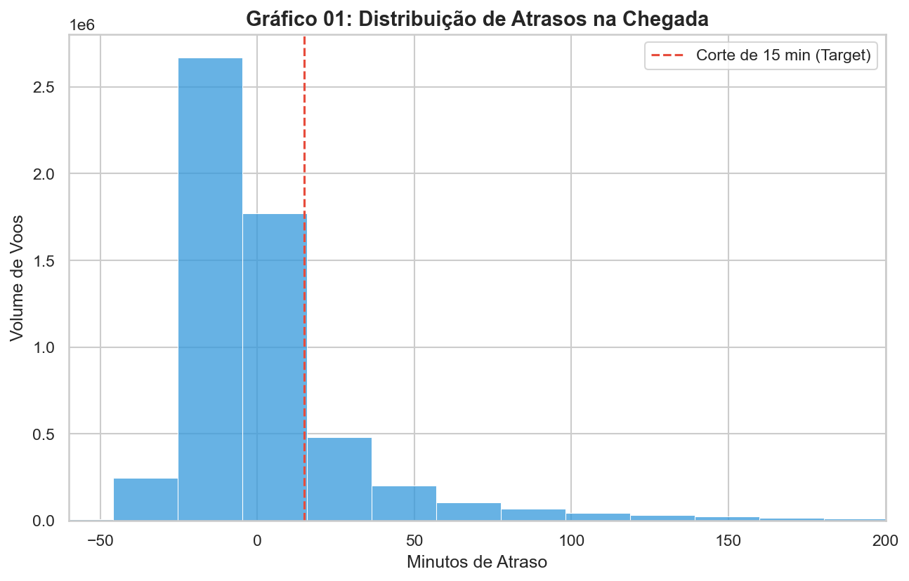
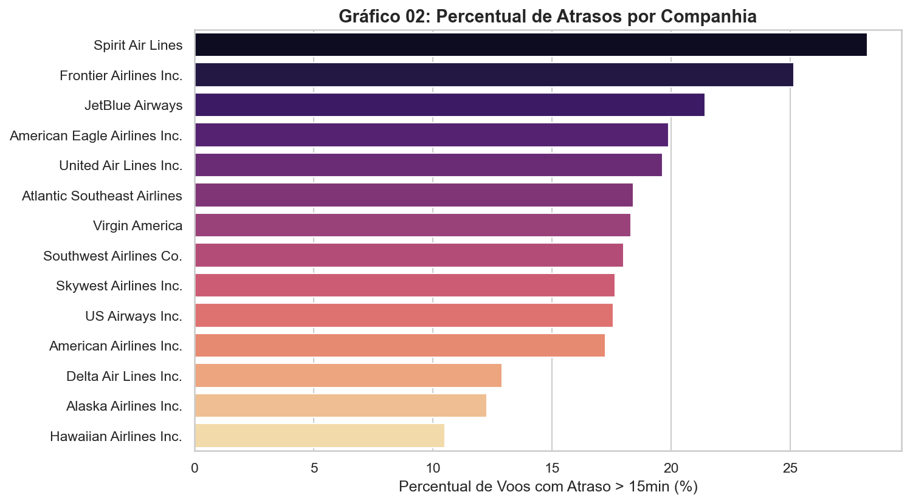
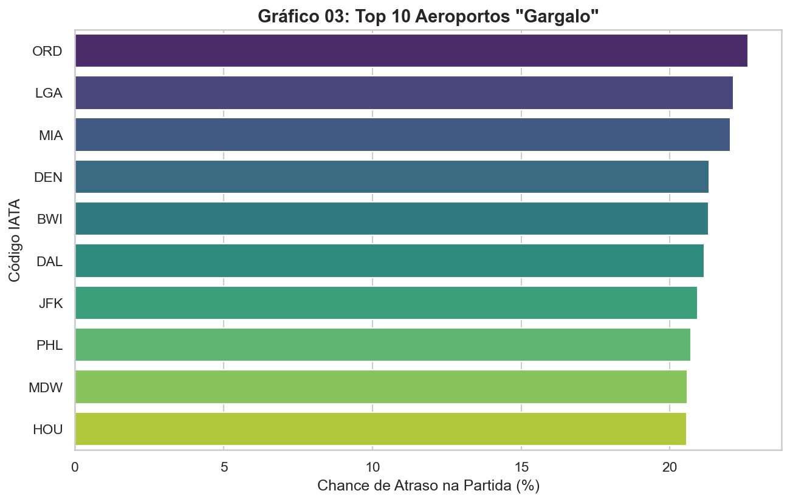
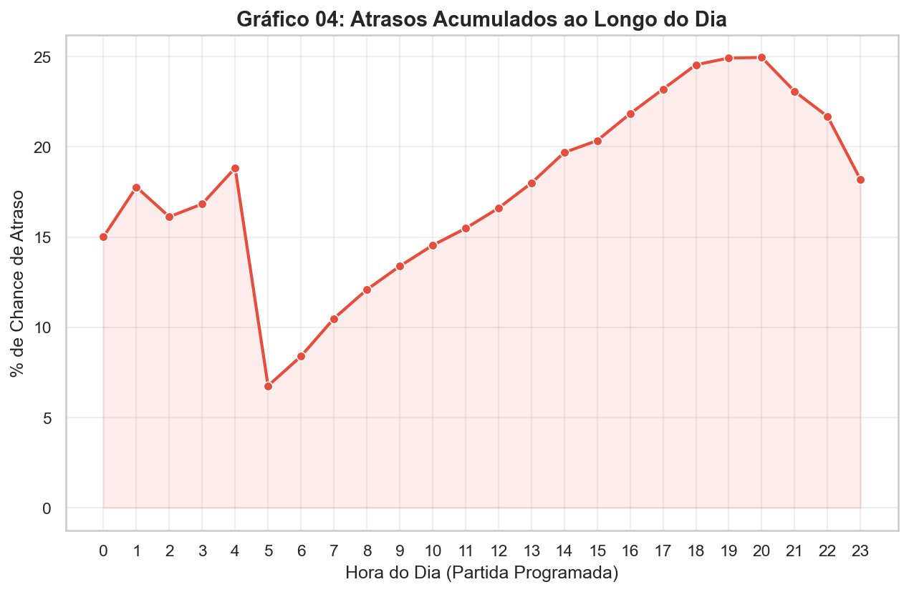
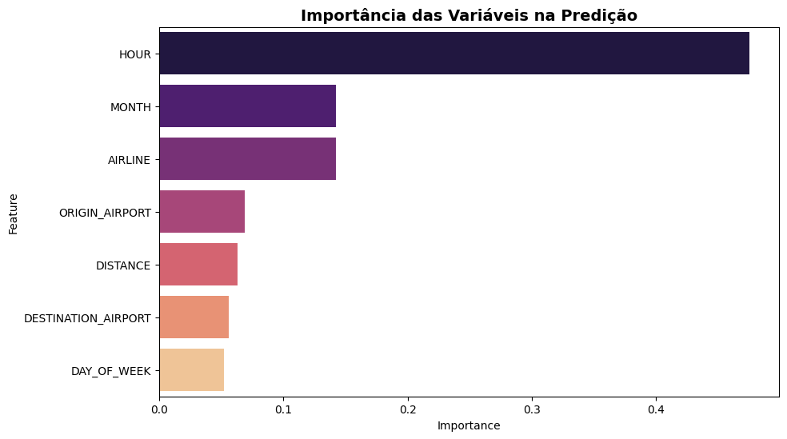
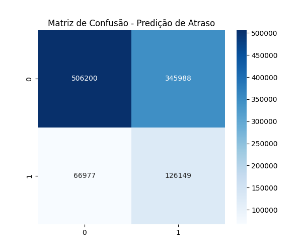
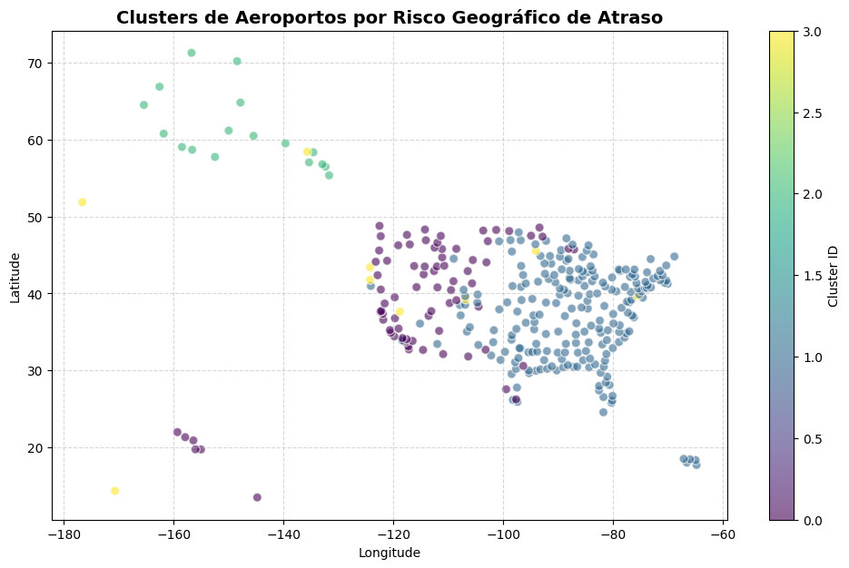

# Fase 3: Machine Learning Engineering ✈️

[](https://www.python.org/)
[](LICENSE)

Este projeto faz parte da Pós-Tech em **Machine Learning Engineering**. O objetivo é analisar dados históricos de voos dos EUA para prever atrasos e identificar padrões geográficos de congestionamento, utilizando técnicas de aprendizado supervisionado e não supervisionado.

---

## 📋 Sobre o Projeto

O transporte aéreo é uma parte vital da infraestrutura global, mas os atrasos impactam milhões de passageiros todos os anos. Neste projeto, utilizamos o dataset público **Flight Delays and Cancellations** para desenvolver análises estatísticas, modelos preditivos e agrupamentos geográficos estratégicos.

### 🎯 Objetivos Principais

- **EDA (Exploração de Dados):** Identificação de padrões, outliers e tendências temporais.
- **Aprendizado Supervisionado:** Classificação de voos com atraso superior a 15 minutos (padrão FAA).
- **Aprendizado Não Supervisionado:** Clusterização de aeroportos por perfil de risco.
- **Engenharia de Dados:** Pipeline ETL otimizado (CSV → Parquet) para ganho de performance.

---

## 🏗️ Estrutura do Pipeline

O projeto foi dividido em 7 etapas sequenciais para garantir consistência e reprodutibilidade:

| Ordem | Script | Descrição |
|------:|--------|-----------|
| 01 | `01_eda.py` | Análise exploratória inicial |
| 02 | `02_graficos.py` | Geração de visualizações |
| 03 | `03_ETL.py` | Extração e transformação inicial |
| 04 | `04_Validacao.py` | Validação preliminar de algoritmos |
| 05 | `05_Limpeza.py` | Conversão otimizada CSV → Parquet |
| 06 | `06_Supervisionado_classificacao_atraso.py` | Modelo Random Forest |
| 07 | `07_Nao_Supervisionado_clusterizacao_geografica.py` | Clusterização com K-Means |

---

## 🛠️ Instalação e Configuração

### 1️⃣ Clonar o Repositório

```bash
git clone <url-do-repositorio>
cd <nome-da-pasta>
```

### 2️⃣ Criar Ambiente Virtual

```bash
python -m venv .venv
```

### 3️⃣ Ativar Ambiente Virtual

**Windows (CMD)**
```bash
.venv\Scripts\activate
```

**Windows (PowerShell)**
```bash
.venv\Scripts\Activate.ps1
```

**Linux / macOS**
```bash
source .venv/bin/activate
```

### 4️⃣ Instalar Dependências

```bash
pip install -r requirements.txt
```

---

## 📥 Download do Dataset Principal

Devido ao limite de tamanho do GitHub, o arquivo principal `flights.csv` (≈ 564 MB) deve ser baixado manualmente.

🔗 **Download direto:**  
[Baixar flights.csv](https://drive.google.com/file/d/1ceyRYUzkF22E_PvwKBF0s2oyhWZpRGGN/view?usp=drive_link)

### 📁 Estrutura esperada da pasta `dataset/`

```
dataset/
├── flights.csv
├── airlines.csv
├── airports.csv
└── dicionario_dados_flights.pdf
```

> Os arquivos `airlines.csv`, `airports.csv` e o dicionário já estão incluídos no repositório.

---

## 🚀 Como Executar

Execute os scripts na ordem numérica:

```bash
python 01_eda.py
python 02_graficos.py
python 03_ETL.py
python 04_Validacao.py
python 05_Limpeza.py
python 06_Supervisionado_classificacao_atraso.py
python 07_Nao_Supervisionado_clusterizacao_geografica.py
```

A partir do script 03_ETL.py, os dados passam a ser armazenados no formato **Parquet** em vez de CSV. Essa mudança foi adotada para melhorar significativamente o desempenho do processamento de dados.

---

## 📂 Organização do Projeto

```
.
├── dataset/
├── parquet/
├── img_eda/
├── img_supervisionado/
├── img_nao_supervisionado/
├── 01_eda.py
├── 02_graficos.py
├── 03_ETL.py
├── 04_Validacao.py
├── 05_Limpeza.py
├── 06_Supervisionado_classificacao_atraso.py
├── 07_Nao_Supervisionado_clusterizacao_geografica.py
├── requirements.txt
└── README.md
```

---


## 📊 Resultados e Conclusões

---

## 🛠️ Engenharia de Dados e Otimização

Para viabilizar a análise de **5.8 milhões de registros** em ambiente local, foi desenvolvido um pipeline de ETL focado em performance e gerenciamento de memória.

O processamento bruto do CSV consumia cerca de **1.45 GB** de RAM. Através de técnicas de **Downcasting** (ajuste de tipagem numérica) e conversão de strings para dados categóricos, reduzimos o consumo para **174 MB** no formato final Parquet.

| Métrica | Antes (CSV Bruto) | Depois (Parquet Otimizado) | Ganho |
| :--- | :--- | :--- | :--- |
| **Memória RAM** | 1457.20 MB | **174.47 MB** | 🔻 **88.03%** |
| **Formato** | Texto (String) / Int64 | Categorical / Int8 / Float32 | Leitura 10x mais rápida |

**Principais Otimizações de Tipagem:**
*   `AIRLINE` / `ORIGIN_AIRPORT`: `object` (string) ➔ `category`
*   `MONTH` / `DAY`: `int64` ➔ `int8`
*   `ARRIVAL_DELAY`: `float64` ➔ `float32`

---

## 📈 Análise Exploratória de Dados (EDA)

Após a estruturação dos dados, os artefatos visuais gerados (`img_eda/`) revelaram padrões comportamentais da malha aérea americana que guiaram a modelagem:

### 1. Definição do Target (`grafico_01_distribuicao.png`)
*   **Insight:** A distribuição de atrasos possui uma cauda longa à direita (assimetria positiva). Atrasos extremos (>3 horas) representam apenas 0.81% dos dados, mas distorcem a média.
*   **Decisão Técnica:** Definimos o problema como **Classificação Binária**. O corte foi estabelecido em **15 minutos** (padrão da FAA - Federal Aviation Administration).

<p align="center">
  
</p>


### 2. Eficiência Operacional (`grafico_02_companhias.png`)
*   **Insight:** Existe uma distinção clara entre modelos de negócio. Companhias *Low-Cost* (ex: Spirit, Frontier) apresentam taxas de atraso sistematicamente maiores que as *Legacy Carriers* (ex: Delta, Alaska).
*   **Decisão:** A variável `AIRLINE` é um preditor indispensável.

<p align="center">
  
</p>

### 3. Gargalos de Infraestrutura (`grafico_03_aeroportos.png`)
*   **Insight:** Aeroportos que funcionam como grandes *Hubs* de conexão (ex: **ORD/Chicago**, **EWR/Newark**) aparecem consistentemente como gargalos. A saturação nestes locais aumenta a probabilidade de atraso independentemente da companhia aérea.

<p align="center">
  
</p>


### 4. Efeito Bola de Neve (`grafico_04_horario.png`)
*   **Insight:** A probabilidade de atraso não é linear ao longo do dia. Voos matinais (06h-09h) têm alta pontualidade, enquanto voos noturnos (20h-23h) sofrem com o acúmulo de atrasos anteriores (*Propagation Effect*).
*   **Decisão:** Criação da feature `SCHEDULED_HOUR` para capturar esse comportamento temporal.

<p align="center">
  
</p>

---

## 🧠 Seleção de Features e Tratamento

Para evitar **Data Leakage** (Vazamento de Dados), segregamos rigorosamente as variáveis disponíveis no momento da compra daquelas geradas apenas após a operação do voo.

### A. Variáveis Removidas (Evitar Vazamento)
*   **`DEPARTURE_TIME`, `DEPARTURE_DELAY`:** Se o avião saiu atrasado, a probabilidade de chegar atrasado é óbvia. O modelo deve prever o atraso, não constatá-lo.
*   **`WHEELS_OFF`, `WHEELS_ON`, `TAXI_IN/OUT`:** Eventos que ocorrem durante a operação.
*   **`AIR_SYSTEM_DELAY`, `WEATHER_DELAY`, etc:** Explicam o motivo do atraso *a posteriori*.
*   **`CANCELLATION_REASON`:** Nulo para voos realizados.

### B. Variáveis Selecionadas (Features do Modelo)
Dados disponíveis no momento do planejamento/compra do bilhete:

1.  **Temporais:**
    *   `MONTH`, `DAY`, `DAY_OF_WEEK`: Capturam sazonalidade (férias, inverno).
    *   `SCHEDULED_HOUR`: Extraído de `SCHEDULED_DEPARTURE` (Crucial para o efeito bola de neve).
    *   *Tratamento:* Mantidos numéricos (`int8`).

2.  **Operacionais/Geográficas:**
    *   `AIRLINE`, `ORIGIN_AIRPORT`, `DESTINATION_AIRPORT`.
    *   *Tratamento:* **Label Encoding** (Transformados em inteiros para processamento pelo Random Forest).

3.  **Físicas:**
    *   `DISTANCE`: Voos mais longos podem permitir recuperação de tempo em cruzeiro?
    *   *Tratamento:* Mantido numérico (`float32`).


---

### 🤖 Aprendizado Supervisionado (Modelagem Preditiva)

O objetivo principal foi prever se um voo sofrerá um atraso superior a 15 minutos (Target Binário). Para isso, comparamos abordagens lineares e baseadas em árvores, optando pelo **Random Forest Classifier** devido à sua robustez contra *outliers* e capacidade de capturar relações não-lineares.

#### ⚙️ Estratégia de Treinamento
*   **Algoritmo:** `RandomForestClassifier` (Scikit-Learn).
*   **Desafio do Desbalanceamento:** A classe positiva (Atraso) representa a minoria dos dados. Modelos padrão tendem a ignorá-la, resultando em Recall próximo de 0%.
*   **Solução:** Utilizamos o hiperparâmetro `class_weight='balanced'`. Isso força o modelo a penalizar severamente erros na classe minoritária, priorizando a detecção de atrasos em detrimento de uma leve queda na precisão global.

#### 📈 Análise de Métricas

| Métrica | Valor | Interpretação de Negócio |
| :--- | :--- | :--- |
| **ROC-AUC Score** | **0.6719** | Indica que o modelo tem uma capacidade razoável de distinguir as classes, considerando que não utilizamos dados meteorológicos em tempo real (maior causa de aleatoriedade). |
| **Recall (Sensibilidade)** | **0.65** | **Resultado Crítico:** O modelo identifica **65% dos atrasos reais**. Antes do balanceamento, este valor era <2%. Em um cenário real, priorizamos alertar o passageiro sobre um risco (mesmo que seja um falso alarme) do que deixá-lo perder uma conexão. |
| **Precision** | **~0.27** | O trade-off aceito: para garantir o alto Recall, o modelo gera mais alertas preventivos. |

#### 🔎 Interpretabilidade

A análise de importância das variáveis (`feature_importances_`) revelou a dinâmica operacional dos atrasos:

1.  **Dominância do Horário (`SCHEDULED_HOUR`):** Representa aproximadamente **48%** da decisão do modelo. Isso confirma estatisticamente o "Efeito Bola de Neve": atrasos matinais se propagam e se intensificam, tornando voos noturnos inerentemente mais arriscados.
2.  **Sazonalidade (`MONTH`):** A segunda variável mais forte, capturando o impacto de meses de inverno (nevascas) e alta temporada de verão.

> **Artefatos:**
> - `img_supervisionado/feature_importance.png`: Ranking de variáveis.

<p align="center">
  
</p>

> - `img_supervisionado/matriz_confusao.png`: Visualização dos Acertos vs. Erros (Trade-off Precisão/Recall).

<p align="center">
  
</p>

---

### 🧩 Aprendizado Não Supervisionado (Clusterização de Risco)

Para entender a geografia do atraso, aplicamos técnicas de agrupamento para segmentar os aeroportos não apenas por localização, mas por **perfil de risco operacional**.

#### 🛠️ Metodologia
*   **Algoritmo:** **K-Means**.
*   **Features de Entrada:** Latitude, Longitude e Taxa Média de Atraso (Target Mean).
*   **Número de Clusters (K):** 4 (definido via Método do Cotovelo/Elbow Method).

#### 📍 Perfis Identificados (Insights)

O algoritmo segmentou a malha aérea americana em 4 zonas distintas:

1.  **Hubs de Alto Risco (Nordeste/Midwest):** Clusters que agrupam aeroportos como **ORD (Chicago)** e **EWR (Newark)**. Caracterizados por alto volume de tráfego e condições climáticas adversas, gerando as maiores médias de atraso.
2.  **Aeroportos Regionais Críticos:** Pequenos aeroportos (ex: Aspen) que, apesar do baixo volume, possuem taxas de atraso extremas devido à geografia complexa.
3.  **Zonas de Eficiência:** Aeroportos em regiões de clima estável (ex: Sul/Oeste) que apresentaram menor variância nos horários.

> **Visualização:**
> O mapa gerado (`img_nao_supervisionado/mapa_clusters_geograficos.png`) permite à gestão identificar visualmente as zonas de gargalo logístico, sugerindo onde alocar mais tempo de solo (buffer) entre voos.

<p align="center">
  
</p>

---


## 📖 Dicionário de Dados

| Coluna | Descrição | Tipo |
|--------|-----------|------|
| YEAR, MONTH, DAY | Data do voo | Inteiro |
| DAY_OF_WEEK | Dia da semana (1=Seg, 7=Dom) | Inteiro |
| AIRLINE | Código da companhia aérea | Categórica |
| ORIGIN_AIRPORT | Código IATA de origem | Categórica |
| DESTINATION_AIRPORT | Código IATA de destino | Categórica |
| DEPARTURE_DELAY | Atraso na partida (minutos) | Numérico |
| ARRIVAL_DELAY | Atraso na chegada (minutos) | Numérico |
| CANCELLED | 1 = cancelado | Binária |
| DISTANCE | Distância em milhas | Numérico |
| AIR_TIME | Tempo de voo em minutos | Numérico |